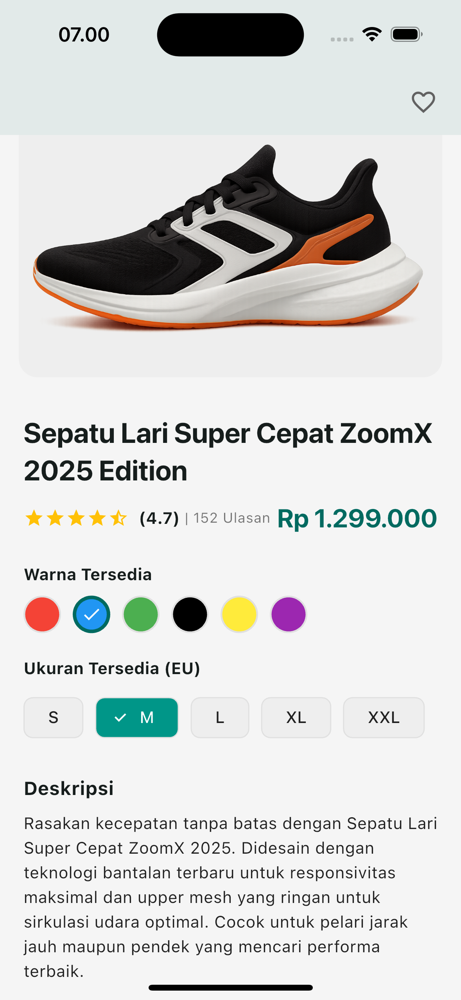
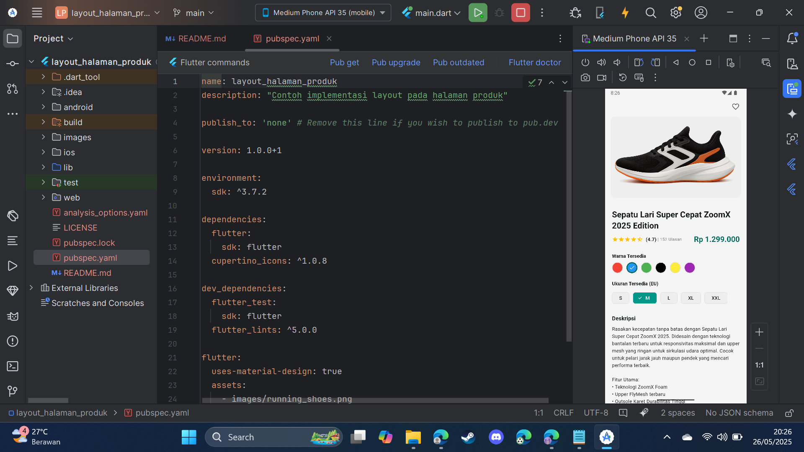

# Layout Halaman Produk (Flutter Layout Example)

Project Flutter sederhana ini didesain sebagai contoh praktis dan studi kasus untuk mempelajari konsep-konsep dasar hingga menengah mengenai **layouting** di Flutter. Fokus utama project ini adalah menunjukkan bagaimana berbagai widget layout Flutter digunakan bersama untuk membangun antarmuka pengguna (UI) halaman detail produk yang responsif.

## Screenshot Aplikasi




## Tujuan Project

* Memberikan contoh nyata implementasi berbagai widget layout Flutter.
* Mendemonstrasikan konsep komposisi widget dalam membangun UI.
* Menunjukkan cara membuat layout yang responsif terhadap ukuran layar berbeda menggunakan `LayoutBuilder`.
* Mengilustrasikan penggunaan `ThemeData` untuk styling terpusat.
* Menjelaskan cara memuat dan menampilkan aset gambar lokal.
* Menjadi bahan belajar atau praktikum bagi pemula hingga menengah yang ingin memperdalam pemahaman layout Flutter.

## Fitur & Konsep Layout yang Didemonstrasikan

* **Struktur Dasar:** Penggunaan `Scaffold` dan `AppBar`.
* **Layout Vertikal:** Implementasi `Column` untuk menyusun elemen dari atas ke bawah.
* **Layout Horizontal:** Implementasi `Row` untuk menyusun elemen dari kiri ke kanan (misal: rating, tombol aksi).
* **Layout Fleksibel Multi-baris:** Penggunaan `Wrap` untuk menampilkan opsi warna dan ukuran yang bisa pindah baris.
* **Pengisian Ruang Fleksibel:** Penggunaan `Expanded` di dalam `Row` untuk membagi ruang secara proporsional (misal: tombol aksi, layout dua kolom).
* **Jarak & Padding:** Penggunaan `Padding` untuk memberi ruang di dalam widget dan `SizedBox` untuk memberi jarak antar widget.
* **Pengaturan Ukuran & Rasio:** Penggunaan `AspectRatio` untuk menjaga rasio gambar dan `Container` untuk styling dasar.
* **Scrolling:** Penggunaan `SingleChildScrollView` agar konten bisa di-scroll pada layar yang lebih kecil atau jika kontennya panjang.
* **Layout Responsif:** Implementasi `LayoutBuilder` untuk mendeteksi lebar layar dan memilih antara layout satu kolom (sempit) atau dua kolom (lebar).
* **Aset Gambar:** Deklarasi aset di `pubspec.yaml` dan pemuatan gambar menggunakan `Image.asset`.
* **Theming Terpusat:** Penggunaan `ThemeData` (`AppTheme`) untuk mengatur skema warna, gaya teks, dan gaya default komponen (Tombol, Chip, Input) secara global.
* **Komposisi & Kode Terstruktur:** Memecah UI menjadi fungsi helper (`_build*`) untuk meningkatkan keterbacaan dan pengelolaan kode.

## Struktur Folder (`lib`)

```
lib/
├── constants/
│   └── app_theme.dart         # Definisi Tema Aplikasi (Warna, Font, Style)
├── screens/
│   └── product_detail_screen.dart # Kode UI dan Layout Halaman Detail Produk
└── main.dart                  # Titik Masuk Aplikasi, Setup MaterialApp
```

## Cara Menjalankan Project

1.  **Prasyarat:** Pastikan Anda sudah menginstal Flutter SDK dan menyiapkan environment pengembangan (Android Studio/VS Code + Emulator/Device).
2.  **Clone/Salin Project:** Dapatkan kode project ini (jika ini adalah repositori, clone; jika tidak, salin file-file kode).
3.  **Siapkan Aset:**
    * Buat folder bernama `images` di *root* direktori project (sejajar dengan `lib`).
    * Masukkan file gambar `running_shoes.png` (atau gambar produk Anda) ke dalam folder `images` tersebut.
4.  **Deklarasi Aset:** Pastikan file `pubspec.yaml` Anda sudah mendeklarasikan folder aset seperti berikut:
    ```yaml
    flutter:
      uses-material-design: true
      assets:
        - images/running_shoes.png
    ```
5.  **Install Dependencies:** Buka terminal di direktori root project, lalu jalankan:
    ```bash
    flutter pub get
    ```
6.  **Pilih Device:** Pastikan emulator Anda berjalan atau perangkat fisik terhubung.
7.  **Jalankan Aplikasi:** Jalankan aplikasi menggunakan perintah berikut di terminal:
    ```bash
    flutter run
    ```
    Atau gunakan tombol "Run" di IDE Anda (Android Studio/VS Code).

## Penjelasan File Kunci

* **`pubspec.yaml`**: File konfigurasi project. Mendefinisikan nama project, versi, dependensi (seperti Flutter SDK itu sendiri), dan yang penting untuk project ini, **mendeklarasikan folder `images/`** agar aset di dalamnya bisa diakses oleh aplikasi.
* **`lib/main.dart`**: Titik masuk (entry point) aplikasi Flutter. Fungsi `main()` memulai aplikasi dengan menjalankan `MyApp`. `MyApp` adalah widget root yang membangun `MaterialApp`, menerapkan tema global dari `AppTheme`, dan menetapkan `ProductDetailScreen` sebagai halaman utama (`home`).
* **`lib/constants/app_theme.dart`**: Mendefinisikan **tampilan visual** keseluruhan aplikasi menggunakan `ThemeData` Material 3. Mengatur palet warna (`ColorScheme`), warna background, gaya teks default, dan terutama **gaya default untuk berbagai komponen** seperti `TextField`, `FilledButton`, `OutlinedButton`, `Chip`, dll. Ini memastikan konsistensi visual dan memudahkan perubahan tema di kemudian hari. Bertindak sebagai "kit styling" internal.
* **`lib/screens/product_detail_screen.dart`**: File inti yang berisi **implementasi layout** untuk halaman detail produk. Di sinilah berbagai widget layout (`Column`, `Row`, `Wrap`, `Expanded`, `Padding`, `SizedBox`, `AspectRatio`, `LayoutBuilder`) digunakan untuk menyusun konten (gambar, teks, tombol). Kode dipecah menjadi fungsi-fungsi helper (`_build*`) untuk kejelasan. `LayoutBuilder` digunakan untuk logika responsif, mengubah tata letak dari satu kolom menjadi dua kolom berdasarkan lebar layar.

## Kesimpulan

Project `layout_halaman_produk` ini menyediakan contoh konkret bagaimana membangun antarmuka pengguna yang terstruktur dan responsif di Flutter. Dengan mempelajari kode ini, Anda dapat melihat penerapan praktis dari berbagai widget layout, pentingnya theming terpusat, dan cara membuat UI yang beradaptasi dengan ukuran layar yang berbeda.