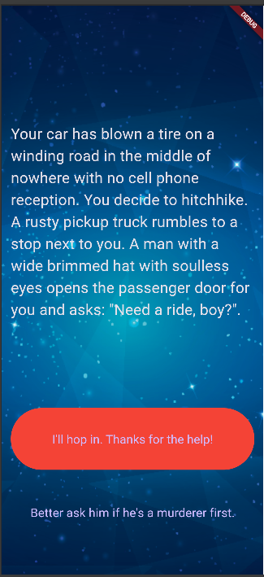

# Destini

## 📜 Deskripsi Singkat

**Destini** adalah aplikasi narasi interaktif bergaya "Pilih Sendiri Petualanganmu" (Choose Your Own Adventure) yang dibangun menggunakan Flutter. Aplikasi ini menyajikan sebuah cerita di mana pengguna harus membuat pilihan yang akan menentukan alur dan akhir dari cerita tersebut. Dengan tema *dark-mode* dan gambar latar yang imersif, aplikasi ini mengajak pengguna masuk ke dalam sebuah skenario thriller yang menegangkan.

## ✨ Fitur-fitur Utama

* **Narasi Bercabang:** Alur cerita berubah secara dinamis berdasarkan pilihan yang dibuat oleh pengguna pada setiap tahap.
* **Manajemen State Terpusat:** Logika cerita dan status progres pengguna dikelola secara efisien di dalam kelas `StoryBrain`, memisahkannya dari lapisan antarmuka (UI).
* **Antarmuka Imersif:** Penggunaan tema gelap dan gambar latar belakang menciptakan suasana yang sesuai dengan cerita.
* **Tombol Pilihan Dinamis:** Tombol pilihan kedua akan muncul atau menghilang secara otomatis tergantung pada konteks cerita, memberikan pengalaman pengguna yang lebih bersih.

## 📁 Struktur Proyek

Logika aplikasi ini dipecah menjadi tiga file utama di dalam direktori `lib/` untuk memastikan kode yang bersih dan terorganisir:

* `main.dart`: Bertanggung jawab untuk membangun antarmuka pengguna (UI), menampilkan cerita dan pilihan, serta menangani interaksi pengguna (menekan tombol).
* `story_brain.dart`: Merupakan "otak" dari aplikasi. Kelas ini berisi semua data cerita, logika untuk berpindah antar cerita berdasarkan pilihan pengguna, dan mengelola status cerita saat ini.
* `story.dart`: Sebuah *class model* sederhana yang mendefinisikan struktur data untuk satu bagian cerita, yang terdiri dari judul cerita dan dua pilihan.

## 📸 Screenshot


*<p align="center">Tampilan utama aplikasi Destini saat cerita dimulai.</p>*

## 🚀 Cara Menjalankan Aplikasi

Berikut adalah panduan untuk menginstal dan menjalankan proyek ini.

### Langkah-langkah Instalasi

1.  **Clone atau Unduh Proyek:**
    Jika ini adalah sebuah repository Git, clone proyeknya.
    ```bash
    git clone [link-repo.git]
    cd nama-repo-anda
    ```

2. **Dapatkan Dependencies (jika ada) dan Proses Assets:**
    Jalankan perintah ini di terminal dari direktori utama proyek Anda.
    ```bash
    flutter pub get
    ```

3. **Jalankan Aplikasi:**
    Pastikan emulator atau perangkat Anda sudah siap, lalu jalankan perintah berikut:
    ```bash
    flutter run
    ```