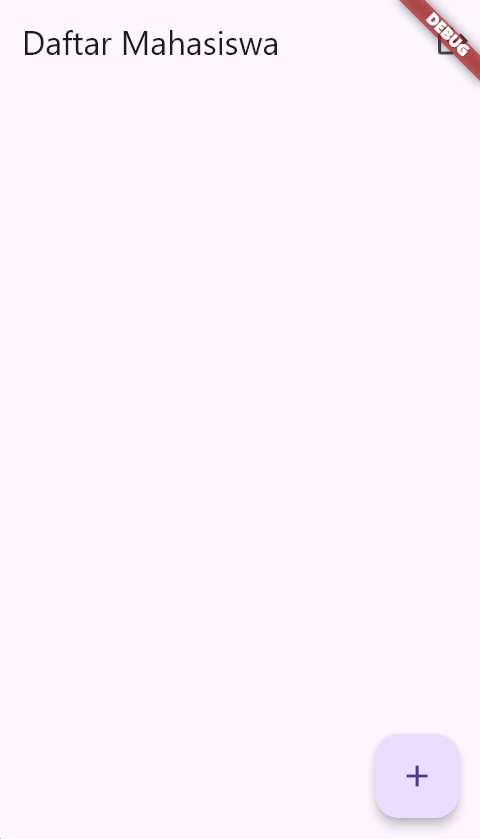
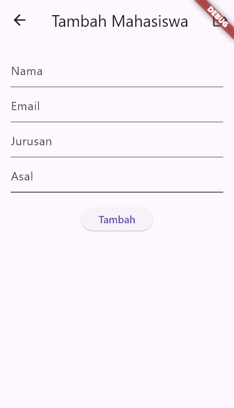
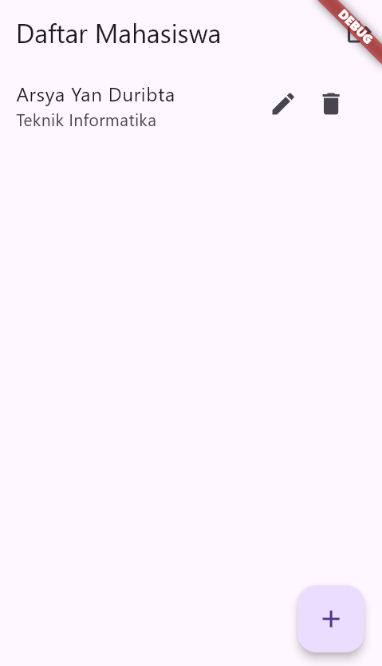

# Aplikasi Manajemen Mahasiswa (Student Management App)

## 📜 Deskripsi Singkat

Aplikasi Manajemen Mahasiswa adalah sebuah aplikasi Flutter fungsional yang menyediakan sistem lengkap untuk mengelola data mahasiswa. Aplikasi ini menerapkan operasi **CRUD (Create, Read, Update, Delete)** secara penuh. Data mahasiswa disimpan secara persisten di dalam database **SQLite** lokal pada perangkat.

Aplikasi ini dimulai dengan halaman login sederhana untuk membatasi akses, kemudian pengguna yang berhasil login dapat melihat, menambah, mengubah, dan menghapus data mahasiswa.

## ✨ Fitur-fitur Utama

* **Autentikasi Pengguna:** Halaman login sederhana untuk mengamankan akses ke data.
* **Create:** Menambah data mahasiswa baru melalui halaman formulir khusus.
* **Read:** Menampilkan seluruh daftar mahasiswa yang tersimpan di halaman utama.
* **Update:** Mengubah data mahasiswa yang sudah ada melalui halaman formulir yang sama.
* **Delete:** Menghapus data mahasiswa langsung dari daftar.
* **Penyimpanan Lokal:** Menggunakan package `sqlite3` untuk membuat dan mengelola database SQLite, memastikan data tetap ada bahkan setelah aplikasi ditutup.
* **Navigasi Multi-Halaman:** Alur navigasi yang jelas antara halaman Login, Daftar Mahasiswa, dan Formulir.
* **Pemisahan Logika:** Menggunakan kelas `DatabaseHelper` sebagai *single source of truth* untuk semua operasi database, memisahkannya dari logika antarmuka (UI).

## 📁 Struktur Proyek

Aplikasi ini memiliki arsitektur multi-file yang terorganisir dengan baik di dalam direktori `lib/`:

* `main.dart`: Titik masuk utama aplikasi. Bertugas untuk menginisialisasi binding Flutter dan database sebelum menjalankan aplikasi.
* `login_page.dart`: Halaman pertama yang dilihat pengguna. Berisi form untuk username dan password.
* `main_page.dart`: Halaman utama setelah login berhasil. Menampilkan daftar mahasiswa dari database dan menyediakan akses ke fungsi tambah, edit, dan hapus.
* `student_form_page.dart`: Halaman formulir yang digunakan untuk menambah data mahasiswa baru dan mengedit data yang sudah ada.
* `database_helper.dart`: Kelas terpusat untuk mengelola semua aspek database SQLite. Ini mencakup inisialisasi database, pembuatan tabel, dan semua operasi CRUD.

## 📸 Screenshot

| Halaman Login | Halaman Utama (Daftar) | Halaman Formulir |
| :---: |:---:|:---:|
|  |  |  |
|  |  |  |

## 🚀 Cara Menjalankan Aplikasi

Berikut adalah panduan untuk menginstal dan menjalankan proyek ini.

### Langkah-langkah Instalasi

1.  **Clone atau Siapkan Proyek:**
    Jika ini adalah sebuah repository Git, clone proyeknya.
    ```bash
    git clone [link-repo.git]
    cd nama-repo-anda
    ```
    Jika Anda memiliki file secara lokal, buat proyek Flutter baru dan lanjutkan ke langkah berikutnya.

2.  **Dapatkan Dependencies:**
    Jalankan perintah ini di terminal dari direktori utama proyek Anda untuk mengunduh semua package yang dibutuhkan.
    ```bash
    flutter pub get
    ```

3.  **Jalankan Aplikasi:**
    Pastikan emulator atau perangkat Anda sudah siap, lalu jalankan perintah berikut:
    ```bash
    flutter run
    ```

### Informasi Login

Gunakan kredensial berikut untuk masuk ke dalam aplikasi:
* **Username:** `admin`
* **Password:** `password`