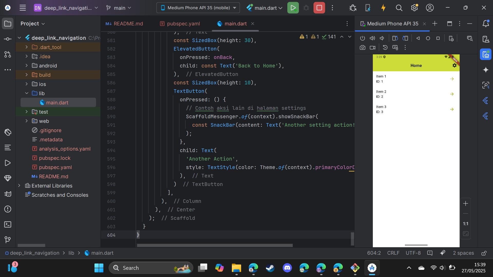
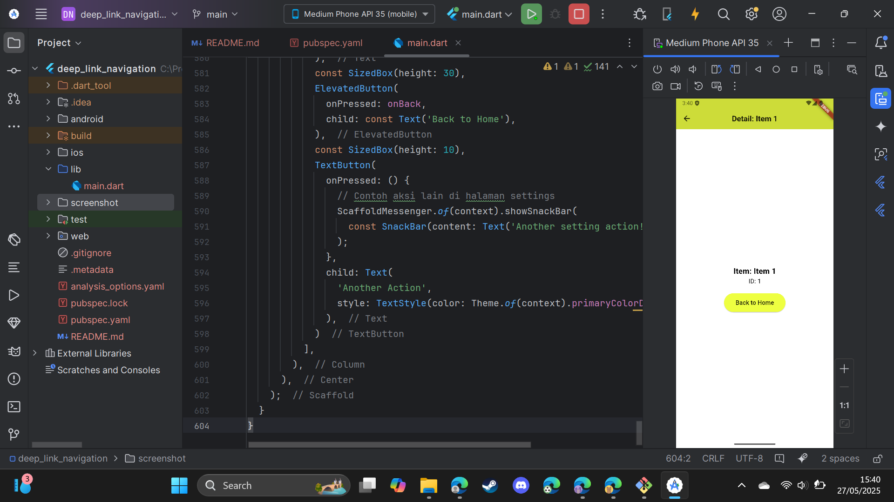
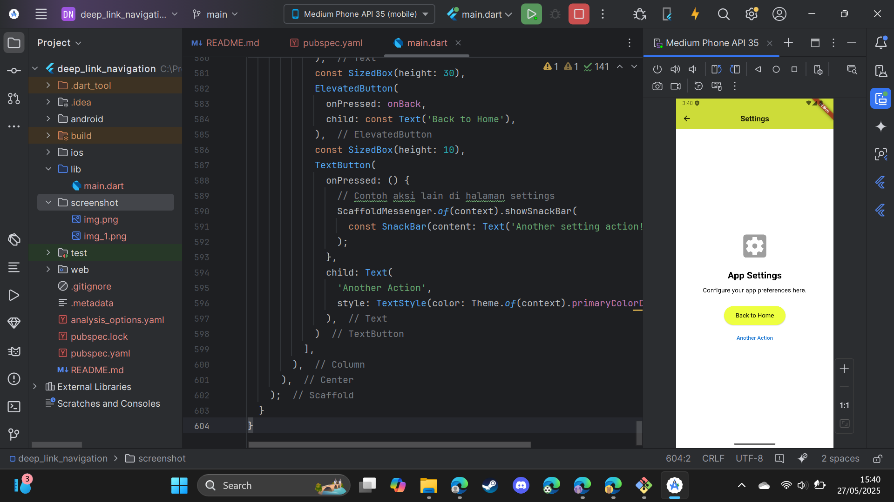

# Laporan Praktikum: Navigasi Lanjutan dan Deep Linking Flutter

## 🎯 Tujuan Praktikum

Praktikum ini bertujuan untuk:

1.  Memahami dan mengimplementasikan konsep **Navigasi 2.0 (Router API)** di Flutter untuk pengelolaan navigasi yang lebih fleksibel dan terpusat.
2.  Menerapkan **navigasi berbasis path (URL)** menggunakan `RouterDelegate` dan `RouteInformationParser`.
3.  Mengaktifkan dan menangani **deep linking** sehingga aplikasi dapat membuka konten atau halaman spesifik berdasarkan URL yang diterima dari luar aplikasi (misalnya, dari browser atau aplikasi lain).
4.  Membangun aplikasi multi-layar (`HomeScreen`, `DetailScreen`, `SettingsScreen`) yang state navigasinya dapat direstorasi dan dikontrol melalui URL.
5.  Mengkustomisasi **tema visual aplikasi**, termasuk skema warna utama (`primarySwatch`) dan warna aksen (`accentColor`/`secondary`).

---

## 🔗 Gambaran Singkat Tentang Deep Linking

**Deep Linking** adalah sebuah mekanisme yang memungkinkan sebuah URL untuk mengarahkan pengguna tidak hanya ke aplikasi, tetapi langsung ke **konten atau halaman spesifik** di dalam aplikasi tersebut. Tanpa deep linking, URL biasanya hanya akan membuka halaman utama aplikasi.

**Contoh Sederhana:**
* URL standar: `https://example.com` -> Membuka website example.com
* URL aplikasi (tanpa deep link): `myapp://` -> Membuka aplikasi `myapp` di halaman utama.
* URL aplikasi (dengan deep link): `myapp://detail/1` -> Membuka aplikasi `myapp` dan langsung menampilkan halaman detail untuk item dengan ID `1`.

**Manfaat Deep Linking:**
* **Pengalaman Pengguna yang Lebih Baik:** Pengguna langsung diarahkan ke konten yang relevan, mengurangi langkah yang diperlukan.
* **Efektivitas Pemasaran:** Kampanye iklan atau email dapat mengarahkan pengguna ke produk atau fitur tertentu.
* **Integrasi Antar Aplikasi:** Memudahkan alur kerja antar aplikasi yang berbeda.
* **Retensi Pengguna:** Mengembalikan pengguna ke titik tertentu dalam aplikasi dengan mudah.

Dalam konteks Flutter, implementasi deep linking melibatkan konfigurasi `RouteInformationParser` untuk mem-parsing URI yang masuk dan `RouterDelegate` untuk memperbarui state aplikasi dan menampilkan halaman yang sesuai.

---

## 🖼️ Implementasi dan Tangkapan Layar Aplikasi

Berikut adalah tangkapan layar dari setiap halaman utama aplikasi beserta keterangannya dan widget yang bertanggung jawab untuk merendernya.

### 1. Halaman Utama (HomeScreen)

Halaman ini menampilkan daftar item yang dapat dipilih pengguna untuk melihat detailnya. Terdapat juga tombol untuk navigasi ke halaman pengaturan.



**Keterangan:**
* **Tampilan:** Daftar item (Item 1, Item 2, Item 3) dan tombol navigasi ke Settings.
* **Widget Utama:** `HomeScreen`
* **Interaksi Terkait:**
    * `ListTile` untuk setiap item: Menavigasi ke `DetailScreen` saat diketuk. Dirender dalam `ListView.builder` di dalam `HomeScreen`.
    * `IconButton` (ikon settings): Menavigasi ke `SettingsScreen`. Ditempatkan di `AppBar` dalam `HomeScreen`.

### 2. Halaman Detail Item (DetailScreen)

Halaman ini menampilkan detail dari item yang dipilih dari `HomeScreen`. Pengguna dapat kembali ke halaman utama dari sini.


**Keterangan:**
* **Tampilan:** Informasi detail item (misalnya, "Item: Item 1", "ID: 1") dan tombol "Back to Home".
* **Widget Utama:** `DetailScreen`
* **Interaksi Terkait:**
    * `Text` widgets: Menampilkan nama dan ID item. Data item diterima melalui konstruktor `DetailScreen`.
    * `ElevatedButton` ("Back to Home"): Menavigasi kembali ke `HomeScreen`.

### 3. Halaman Pengaturan (SettingsScreen)

Halaman ini merupakan halaman placeholder untuk pengaturan aplikasi. Pengguna dapat kembali ke halaman utama.


**Keterangan:**
* **Tampilan:** Judul "Settings", ikon pengaturan, teks deskriptif, dan tombol "Back to Home".
* **Widget Utama:** `SettingsScreen`
* **Interaksi Terkait:**
    * `ElevatedButton` ("Back to Home"): Menavigasi kembali ke `HomeScreen`.

---

## ⚙️ Cara Menjalankan Aplikasi

1.  Pastikan Anda telah menginstal Flutter SDK di sistem Anda.
2.  Clone repositori ini (jika proyek ini ada di sebuah repositori Git).
    ```bash
    # git clone <URL_REPOSITORI_ANDA>
    # cd <NAMA_DIREKTORI_PROYEK>
    ```
3.  Buka proyek menggunakan IDE favorit Anda (misalnya, VS Code, Android Studio).
4.  Pastikan semua dependensi terinstal dengan menjalankan:
    ```bash
    flutter pub get
    ```
5.  Jalankan aplikasi pada emulator atau perangkat fisik yang terhubung:
    ```bash
    flutter run
    ```