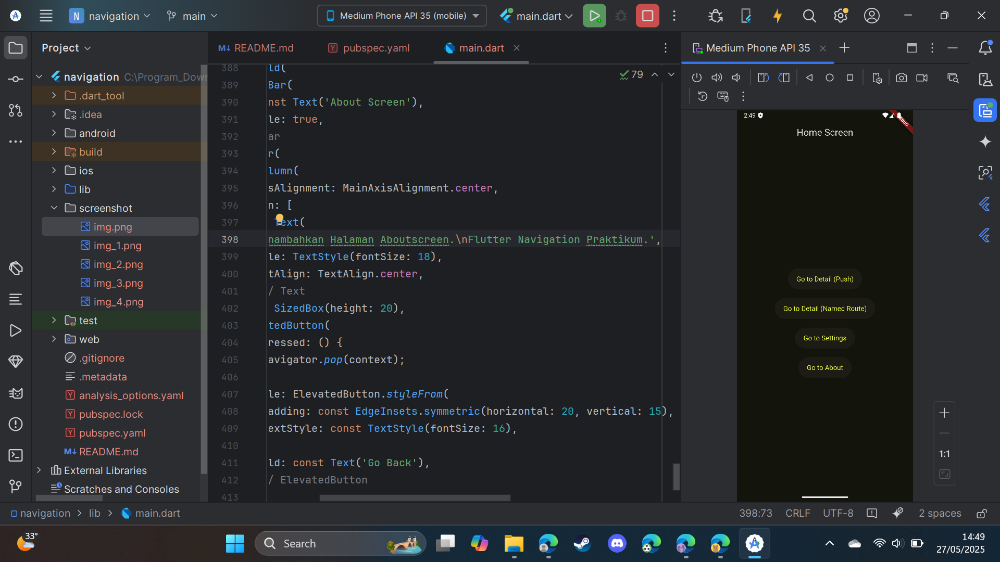
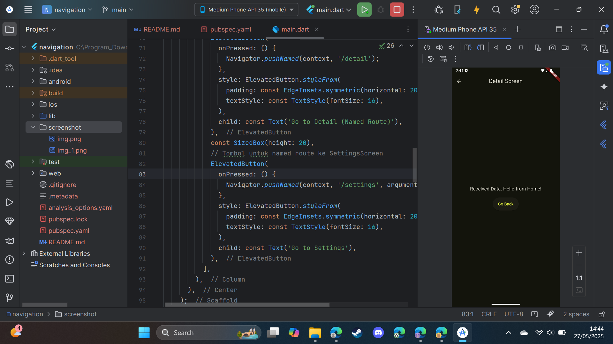
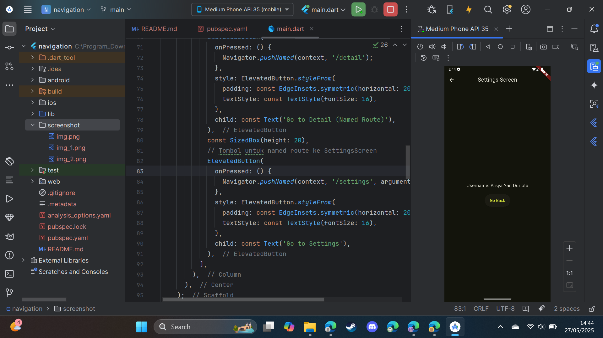

# Praktikum Navigasi Flutter

Proyek Flutter sederhana ini mendemonstrasikan berbagai aspek navigasi antar layar, termasuk navigasi dasar, penggunaan *named routes*, dan pengiriman data antar layar.

## 🎯 Tujuan Praktikum

Tujuan utama dari praktikum ini adalah untuk:

1.  Mempelajari bagaimana aplikasi Flutter berpindah antar layar (screen/route).
2.  Mempelajari `Navigator.push` untuk membuka layar baru menggunakan `MaterialPageRoute` dan `Navigator.pop` untuk kembali.
3.  Mempelajari cara mendefinisikan rute dengan nama unik (String) melalui `MaterialApp` dan bernavigasi menggunakan `Navigator.pushNamed`. Ini membantu mengelola navigasi secara lebih terstruktur.
4.  Mempraktikkan cara mengirimkan data dari satu layar ke layar lainnya, baik melalui constructor (untuk `MaterialPageRoute`) maupun melalui `arguments` (untuk `pushNamed`).
5.  Mempelajari cara layar tujuan menerima data yang dikirimkan dan menampilkannya kepada pengguna.
6.  Memahami bagaimana named routes dapat membuat kode navigasi lebih bersih, terpusat, dan mudah dilacak, terutama pada aplikasi yang lebih besar.

## 🧭 Gambaran Singkat tentang Named Routes

**Named Routes** adalah sebuah mekanisme dalam Flutter untuk memberikan **nama unik (berupa String)** kepada rute-rute (layar-layar) dalam aplikasi Anda. Alih-alih membuat instance `MaterialPageRoute` secara manual setiap kali Anda ingin berpindah layar, Anda cukup memanggil `Navigator.pushNamed(context, '/namaRute');`.

**Keuntungan Menggunakan Named Routes:**

* **Keterbacaan Kode (Readability):** Kode navigasi menjadi lebih jelas karena menggunakan nama deskriptif (misalnya, `'/settings'`, `'/productDetail'`).
* **Manajemen Rute Terpusat:** Semua definisi rute terkumpul di satu tempat (properti `routes` di `MaterialApp`), memudahkan pengelolaan dan modifikasi alur navigasi.
* **Mengurangi Boilerplate:** Menghindari penulisan `MaterialPageRoute(builder: (context) => MyScreen())` berulang kali.
* **Passing Arguments:** Memungkinkan pengiriman data ke named route menggunakan properti `arguments` pada `Navigator.pushNamed`. Data ini kemudian dapat diakses di layar tujuan melalui `ModalRoute.of(context)!.settings.arguments`.
* **Potensi Deep Linking:** Memudahkan implementasi deep linking di masa depan.

**Cara Kerja Singkat:**
1.  **Definisikan Rute:** Rute didaftarkan dalam `Map<String, WidgetBuilder>` pada properti `routes` dari widget `MaterialApp`.
2.  **Navigasi:** Berpindah layar menggunakan `Navigator.pushNamed(context, '/namaRute');`.
3.  **Mengirim Data (Opsional):** `Navigator.pushNamed(context, '/detail', arguments: 'Data penting');`.
4.  **Menerima Data (Opsional):** `final data = ModalRoute.of(context)?.settings.arguments;`.

## 🖼️ Screenshot Aplikasi
---

### 1. `HomeScreen`

* **Deskripsi Tangkapan Layar:**
  Menampilkan layar utama aplikasi. Terdapat `AppBar` dengan judul "Home Screen". Di bagian tengah, terdapat empat tombol yang disusun secara vertikal: "Go to Detail (Push)", "Go to Detail (Named Route)", "Go to Settings", dan "Go to About". Tema aplikasi adalah gelap dengan aksen warna lime.
* **Widget Terkait:**
    * `Scaffold`: Kerangka dasar layar.
    * `AppBar`: Bilah atas dengan judul.
        * `Text`: Menampilkan "Home Screen".
    * `Center`: Memposisikan konten di tengah.
    * `Column`: Menyusun tombol secara vertikal.
    * `ElevatedButton` (4 buah): Tombol untuk aksi navigasi.
        * `Text`: Label pada masing-masing tombol.
    * `SizedBox`: Memberikan spasi antar tombol.
* **Tangkapan Layar:**
  

---

### 2. `DetailScreen` (diakses melalui "Go to Detail (Push)")

* **Deskripsi Tangkapan Layar:**
  Menampilkan layar detail setelah navigasi menggunakan `Navigator.push` dengan `MaterialPageRoute`. `AppBar` bertuliskan "Detail Screen". Konten utama menampilkan teks "Received Data: Data from Home (Push)" dan sebuah tombol "Go Back".
* **Widget Terkait:**
    * `Scaffold`, `AppBar` (`Text` untuk judul).
    * `Center`, `Column`.
    * `Text`: Menampilkan data yang diterima melalui constructor widget (`Data from Home (Push)`).
    * `ElevatedButton` (`Text` untuk "Go Back"): Untuk kembali ke layar sebelumnya (`Navigator.pop`).
* **Tangkapan Layar:**
  

---

### 3. `DetailScreen` (diakses melalui "Go to Detail (Named Route)")

* **Deskripsi Tangkapan Layar:**
  Menampilkan layar detail setelah navigasi menggunakan `Navigator.pushNamed(context, '/detail', arguments: ...)`. `AppBar` bertuliskan "Detail Screen". Konten utama menampilkan teks "Received Data: Data for Detail from Home (Named)" (karena argumen dikirim dari `HomeScreen`) dan sebuah tombol "Go Back". Jika tidak ada argumen yang dikirim (dan constructor memiliki default), maka akan menampilkan data default dari definisi route.
* **Widget Terkait:**
    * `Scaffold`, `AppBar` (`Text` untuk judul).
    * `Center`, `Column`.
    * `Text`: Menampilkan data yang diterima melalui `ModalRoute.of(context)?.settings.arguments` (`Data for Detail from Home (Named)`).
    * `ElevatedButton` (`Text` untuk "Go Back").
* **Tangkapan Layar:**
  

---

### 4. `SettingsScreen` (diakses melalui "Go to Settings")

* **Deskripsi Tangkapan Layar:**
  Menampilkan layar pengaturan. `AppBar` bertuliskan "Settings Screen". Konten utama menampilkan teks "Username: Arsya Yan Duribta" (data diterima sebagai argumen melalui `pushNamed`) dan sebuah tombol "Go Back".
* **Widget Terkait:**
    * `Scaffold`, `AppBar` (`Text` untuk judul).
    * `Center`, `Column`.
    * `Text`: Menampilkan username yang diterima melalui `ModalRoute.of(context)?.settings.arguments`.
    * `ElevatedButton` (`Text` untuk "Go Back").
* **Tangkapan Layar:**
  

---

### 5. `AboutScreen` (diakses melalui "Go to About")

* **Deskripsi Tangkapan Layar:**
  Menampilkan layar "Tentang Aplikasi". `AppBar` bertuliskan "About Screen". Konten utama menampilkan teks "This is the About Screen. Flutter Navigation Practicum." dan sebuah tombol "Go Back".
* **Widget Terkait:**
    * `Scaffold`, `AppBar` (`Text` untuk judul).
    * `Center`, `Column`.
    * `Text`: Menampilkan informasi tentang aplikasi.
    * `ElevatedButton` (`Text` untuk "Go Back").
* **Tangkapan Layar:**
  ``

---

## ⚙️ Cara Menjalankan Aplikasi

1.  Pastikan Anda telah menginstal Flutter SDK di sistem Anda.
2.  Clone repositori ini (jika proyek ini ada di sebuah repositori Git).
    ```bash
    # git clone <URL_REPOSITORI_ANDA>
    # cd <NAMA_DIREKTORI_PROYEK>
    ```
3.  Buka proyek menggunakan IDE favorit Anda (misalnya, VS Code, Android Studio).
4.  Pastikan semua dependensi terinstal dengan menjalankan:
    ```bash
    flutter pub get
    ```
5.  Jalankan aplikasi pada emulator atau perangkat fisik yang terhubung:
    ```bash
    flutter run
    ```