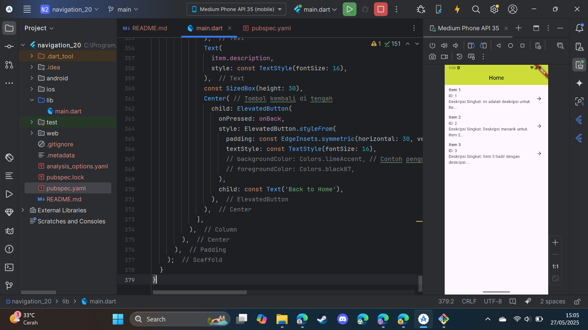
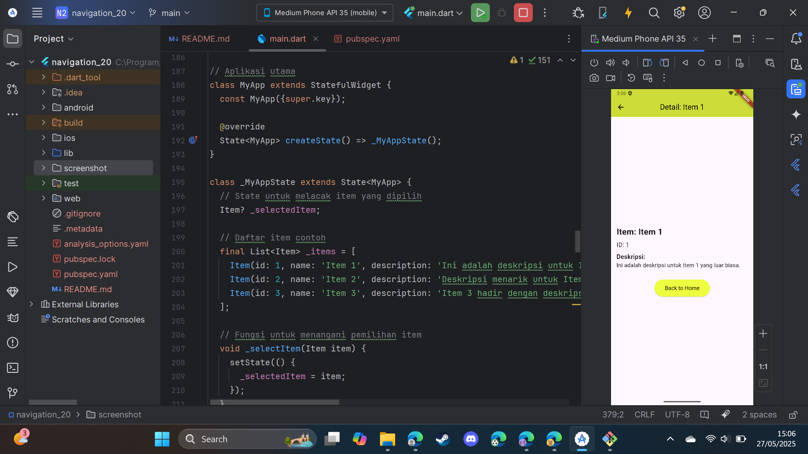

Okay, here's a `README.md` file based on your Flutter application and requirements.

---

# Praktikum Flutter: Implementasi Navigator 2.0 dan Kustomisasi UI

## 📝 Tujuan Praktikum

Tujuan dari praktikum ini adalah:

1.  Memahami konsep dasar dan implementasi **Navigator 2.0** (Router API) pada Flutter untuk pengelolaan navigasi halaman secara deklaratif.
2.  Mempelajari cara mengelola *state* aplikasi untuk mengontrol tumpukan navigasi (navigation stack).
3.  Menerapkan navigasi antara dua layar: layar daftar (HomeScreen) dan layar detail (DetailScreen).
4.  Melakukan kustomisasi pada model data (`Item`) dengan menambahkan field baru (`description`).
5.  Menampilkan data tambahan tersebut pada antarmuka pengguna (`DetailScreen`).
6.  Mengubah skema warna (`ThemeData`) aplikasi Flutter.

## 🚀 Gambaran Singkat Navigator 2.0

**Navigator 2.0** (juga dikenal sebagai Router API) adalah pendekatan yang lebih baru dan lebih fleksibel untuk menangani navigasi di Flutter dibandingkan dengan Navigator 1.0 (imperatif). Navigator 2.0 bersifat **deklaratif**, artinya Anda mendefinisikan *state* dari tumpukan navigasi (daftar halaman yang harus ditampilkan), dan Flutter akan membangun UI navigasi berdasarkan *state* tersebut.

Karakteristik utama Navigator 2.0:

* **Page-based**: Navigasi dikelola berdasarkan daftar `Page` objek. Perubahan pada daftar ini (menambah atau menghapus `Page`) akan memicu pembaruan UI navigasi.
* **Declarative**: Anda tidak memanggil `Navigator.push()` atau `Navigator.pop()` secara langsung untuk mengubah tumpukan. Sebaliknya, Anda mengubah *state* yang merepresentasikan tumpukan halaman, dan widget `Navigator` akan bereaksi terhadap perubahan *state* tersebut.
* **Kontrol Penuh atas Tumpukan Navigasi**: Memberikan kontrol penuh atas seluruh tumpukan navigasi, yang sangat berguna untuk skenario kompleks seperti deep linking, navigasi web, dan pemulihan *state* navigasi.
* **Integrasi dengan URL Browser**: Lebih mudah untuk menyinkronkan *state* navigasi aplikasi dengan URL di browser web.

Dalam aplikasi ini, kita menggunakan widget `Navigator` dengan properti `pages` untuk mendefinisikan tumpukan halaman secara deklaratif berdasarkan `_selectedItem`. Callback `onPopPage` digunakan untuk menangani ketika sebuah halaman di-pop dari tumpukan.

---

## 📸 Tangkapan Layar Aplikasi

Berikut adalah tangkapan layar dari aplikasi beserta keterangannya dan widget yang relevan:

### 1. HomeScreen

**Keterangan:**
Tangkapan layar ini menunjukkan halaman utama (`HomeScreen`) aplikasi. Halaman ini menampilkan daftar item yang tersedia. Setiap item dalam daftar menampilkan nama, ID, dan cuplikan singkat dari deskripsinya. Pengguna dapat mengetuk salah satu item untuk melihat detailnya.

**Widget Utama yang Terlihat:**

* `Scaffold`: Menyediakan struktur visual dasar halaman (AppBar, body).
* `AppBar`: Menampilkan judul "Home" di bagian atas. Di-styling dengan `primarySwatch: Colors.lime`.
* `ListView.builder`: Digunakan untuk menampilkan daftar item secara efisien, terutama jika daftar item sangat panjang.
* `ListTile`: Merepresentasikan setiap item dalam daftar.
    * `title`: `Text` widget untuk menampilkan `item.name`.
    * `subtitle`: `Text` widget untuk menampilkan `item.id` dan cuplikan `item.description`.
    * `trailing`: `Icon(Icons.arrow_forward)` sebagai indikator bahwa item dapat diklik.
    * `onTap`: Fungsi callback yang dipanggil ketika item diketuk, memicu navigasi ke `DetailScreen`.
      
---

### 2. DetailScreen

**Keterangan:**
Tangkapan layar ini menunjukkan halaman detail (`DetailScreen`) setelah pengguna memilih salah satu item dari `HomeScreen`. Halaman ini menampilkan informasi lengkap tentang item yang dipilih, termasuk ID, nama, dan deskripsi lengkapnya. Terdapat juga tombol untuk kembali ke `HomeScreen`.

**Widget Utama yang Terlihat:**

* `Scaffold`: Menyediakan struktur visual dasar halaman.
* `AppBar`: Menampilkan judul "Detail: \[Nama Item]" (misalnya, "Detail: Item 1"). Di-styling dengan `primarySwatch: Colors.lime`.
* `Padding`: Memberikan ruang di sekitar konten utama.
* `Center`: Memusatkan konten di tengah layar.
* `Column`: Menyusun widget-widget konten (nama, ID, deskripsi, tombol) secara vertikal.
* `Text`: Digunakan untuk menampilkan `item.name`, `item.id`, dan `item.description`. Teks diformat dengan `TextStyle` yang berbeda untuk penekanan.
* `SizedBox`: Memberikan spasi vertikal antar elemen.
* `ElevatedButton`: Tombol "Back to Home" yang memungkinkan pengguna untuk kembali ke `HomeScreen`. Tombol ini di-styling dengan `ElevatedButtonThemeData` menggunakan `Colors.limeAccent` sebagai `backgroundColor`.
    * `onPressed`: Fungsi callback yang dipanggil ketika tombol ditekan, membersihkan `_selectedItem` dan memicu navigasi kembali ke `HomeScreen`.
      
---

## ⚙️ Cara Menjalankan Aplikasi

1.  Pastikan Anda telah menginstal Flutter SDK di sistem Anda.
2.  Clone repositori ini (jika proyek ini ada di sebuah repositori Git).
    ```bash
    # git clone <URL_REPOSITORI_ANDA>
    # cd <NAMA_DIREKTORI_PROYEK>
    ```
3.  Buka proyek menggunakan IDE favorit Anda (misalnya, VS Code, Android Studio).
4.  Pastikan semua dependensi terinstal dengan menjalankan:
    ```bash
    flutter pub get
    ```
5.  Jalankan aplikasi pada emulator atau perangkat fisik yang terhubung:
    ```bash
    flutter run
    ```