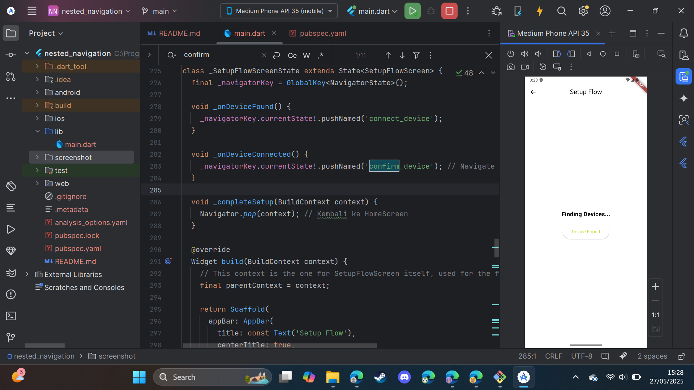
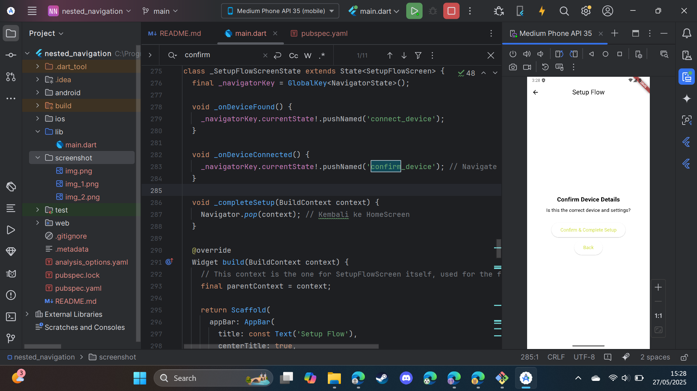

# Praktikum Nested Navigation Flutter

Proyek Flutter ini mendemonstrasikan implementasi Nested Navigation untuk membuat alur pengguna yang lebih terstruktur di dalam sebuah aplikasi, khususnya untuk proses pengaturan (setup flow). Aplikasi ini juga menampilkan penggunaan tema kustom dengan `Colors.lime`.

---

## Tujuan Praktikum

Adapun tujuan dari praktikum ini adalah sebagai berikut:
1.  Memahami konsep **Nested Navigation** (Navigasi Bersarang) dalam Flutter.
2.  Mengimplementasikan **Navigator** di dalam sebuah halaman (screen) untuk mengelola alur navigasi internal halaman tersebut tanpa mempengaruhi Navigator utama aplikasi.
3.  Membuat alur pengguna multi-langkah (multi-step flow) yang mandiri di dalam satu bagian aplikasi.
4.  Mengelola state dan transisi antar sub-halaman dalam alur navigasi bersarang.
5.  Menerapkan tema dasar dan kustomisasi warna pada aplikasi Flutter.

---

## Gambaran Singkat tentang Nested Navigation

**Nested Navigation** (Navigasi Bersarang) adalah teknik dalam Flutter di mana sebuah widget `Navigator` disematkan di dalam halaman (widget) lain yang juga dikelola oleh `Navigator` tingkat atas (root navigator).

Bayangkan aplikasi Anda memiliki beberapa bagian utama seperti Home, Profil, dan Pengaturan. Masing-masing bagian ini dikelola oleh Navigator utama. Kemudian, di dalam bagian Pengaturan, Anda mungkin memiliki alur yang kompleks, misalnya untuk mengatur perangkat baru. Alur ini bisa terdiri dari beberapa langkah: mencari perangkat, menghubungkan, dan konfirmasi.

Daripada membuat setiap langkah ini sebagai rute di Navigator utama, kita bisa menyematkan `Navigator` baru khusus di dalam halaman "Pengaturan Perangkat". `Navigator` bersarang ini akan mengelola navigasi antar langkah-langkah (sub-halaman) dalam alur pengaturan perangkat tersebut.

**Keuntungan Nested Navigation:**
* **Modularitas:** Alur navigasi internal menjadi mandiri dan lebih mudah dikelola.
* **State Terisolasi:** State navigasi untuk alur bersarang tidak tercampur dengan state navigasi utama.
* **Pengalaman Pengguna yang Lebih Baik:** Transisi dalam alur bersarang bisa terasa lebih mulus dan terintegrasi, serta AppBar utama aplikasi bisa tetap konsisten sementara konten di bawahnya berganti.
* **Tombol Kembali yang Intuitif:** Tombol kembali fisik atau gestur dapat dikonfigurasi untuk bernavigasi dalam alur bersarang terlebih dahulu sebelum keluar dari alur tersebut.

Dalam proyek ini, `SetupFlowScreen` bertindak sebagai host untuk `Navigator` bersarang yang mengelola transisi antara `FindDevicesScreen`, `ConnectDeviceScreen`, dan `ConfirmDeviceScreen`.

---

## Alur Aplikasi dan Tangkapan Layar

Berikut adalah alur aplikasi beserta tangkapan layar dan widget terkait:

### 1. Halaman Utama (HomeScreen)

* **Tangkapan Layar:**
  
* 
* **Keterangan:** Ini adalah halaman awal aplikasi. Pengguna dapat memulai alur pengaturan dari sini.
* **Widget Utama:** `HomeScreen`
* **Relasi Widget:**
    * `Scaffold`: Kerangka dasar halaman.
    * `AppBar`: Menampilkan judul "Home".
    * `ElevatedButton('Start Setup Flow')`: Tombol untuk memulai navigasi ke `SetupFlowScreen`.

### 2. Memulai Alur Pengaturan (SetupFlowScreen - Tampilan Awal: FindDevicesScreen)

* **Tangkapan Layar:**
  

* **Keterangan:** Setelah menekan "Start Setup Flow", pengguna diarahkan ke `SetupFlowScreen`. Halaman ini memiliki `AppBar` sendiri ("Setup Flow") dan `Navigator` bersarang. Tampilan awal dalam `Navigator` bersarang ini adalah `FindDevicesScreen`.
* **Widget Utama:** `SetupFlowScreen` (sebagai host)
* **Widget Konten (dalam Navigator bersarang):** `FindDevicesScreen`
* **Relasi Widget (`SetupFlowScreen`):**
    * `Scaffold`: Kerangka dasar untuk alur pengaturan.
    * `AppBar`: Menampilkan judul "Setup Flow" dan tombol kembali untuk keluar dari seluruh alur pengaturan.
    * `Navigator`: Widget yang mengelola rute `find_devices`, `connect_device`, dan `confirm_device`.
* **Relasi Widget (`FindDevicesScreen`):**
    * `Text('Finding Devices...')`: Menampilkan status.
    * `ElevatedButton('Device Found')`: Memicu navigasi ke halaman berikutnya dalam alur bersarang (`ConnectDeviceScreen`) melalui callback `_onDeviceFound`.

### 3. Alur Pengaturan - Menghubungkan Perangkat (ConnectDeviceScreen)

* **Tangkapan Layar:**
  
* 
* **Keterangan:** Setelah "menemukan perangkat", pengguna diarahkan ke `ConnectDeviceScreen` di dalam `Navigator` bersarang milik `SetupFlowScreen`.
* **Widget Utama:** `SetupFlowScreen` (sebagai host)
* **Widget Konten (dalam Navigator bersarang):** `ConnectDeviceScreen`
* **Relasi Widget (`ConnectDeviceScreen`):**
    * `Text('Connecting to Device...')`: Menampilkan status.
    * `ElevatedButton('Device Connected, Next')`: Memicu navigasi ke halaman berikutnya (`ConfirmDeviceScreen`) melalui callback `_onDeviceConnected`.
    * `ElevatedButton('Back')`: Kembali ke `FindDevicesScreen` dalam `Navigator` bersarang.

### 4. Alur Pengaturan - Konfirmasi Perangkat (ConfirmDeviceScreen)

* **Tangkapan Layar:**
  

* **Keterangan:** Setelah "perangkat terhubung", pengguna diarahkan ke `ConfirmDeviceScreen` untuk konfirmasi akhir.
* **Widget Utama:** `SetupFlowScreen` (sebagai host)
* **Widget Konten (dalam Navigator bersarang):** `ConfirmDeviceScreen`
* **Relasi Widget (`ConfirmDeviceScreen`):**
    * `Text('Confirm Device Details')`: Menampilkan judul halaman konfirmasi.
    * `ElevatedButton('Confirm & Complete Setup')`: Menyelesaikan alur pengaturan dan kembali ke `HomeScreen` melalui callback `_completeSetup`.
    * `ElevatedButton('Back')`: Kembali ke `ConnectDeviceScreen` dalam `Navigator` bersarang.

### 5. Penyelesaian Alur Pengaturan

* **Keterangan:** Setelah menekan "Confirm & Complete Setup" pada `ConfirmDeviceScreen`, fungsi `_completeSetup` dipanggil. Ini akan melakukan `Navigator.pop(context)` pada konteks `SetupFlowScreen`, sehingga seluruh `SetupFlowScreen` ditutup dan aplikasi kembali ke `HomeScreen`. Tidak ada tangkapan layar khusus untuk aksi ini, karena hasilnya adalah kembali ke `HomeScreen` (poin 1).

---

## ⚙️ Cara Menjalankan Aplikasi

1.  Pastikan Anda telah menginstal Flutter SDK di sistem Anda.
2.  Clone repositori ini (jika proyek ini ada di sebuah repositori Git).
    ```bash
    # git clone <URL_REPOSITORI_ANDA>
    # cd <NAMA_DIREKTORI_PROYEK>
    ```
3.  Buka proyek menggunakan IDE favorit Anda (misalnya, VS Code, Android Studio).
4.  Pastikan semua dependensi terinstal dengan menjalankan:
    ```bash
    flutter pub get
    ```
5.  Jalankan aplikasi pada emulator atau perangkat fisik yang terhubung:
    ```bash
    flutter run
    ```