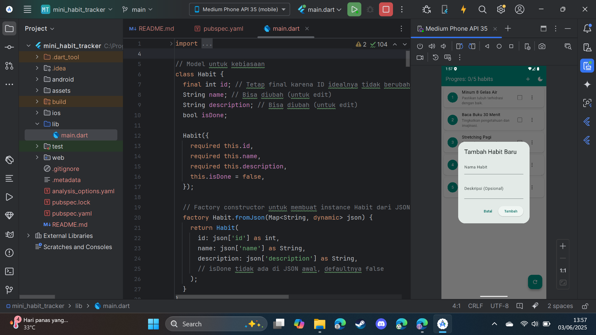
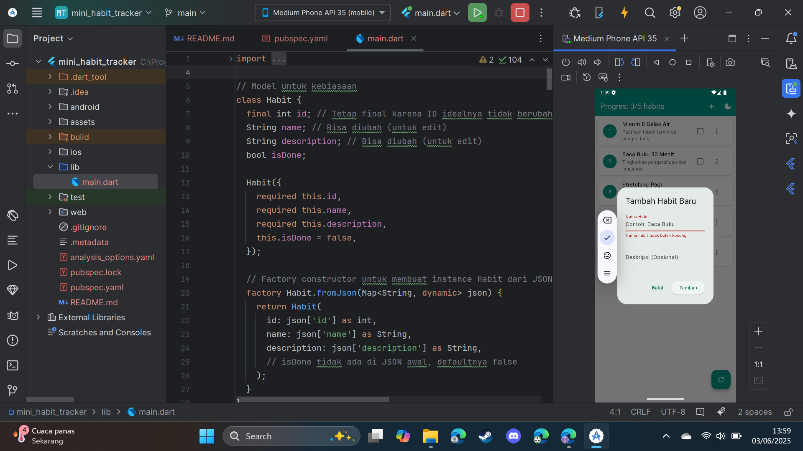
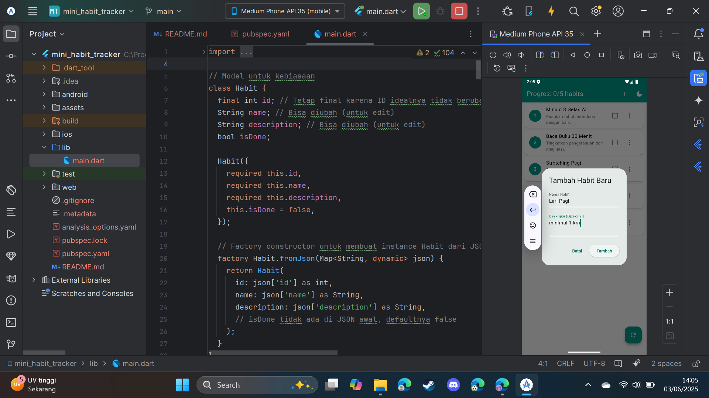
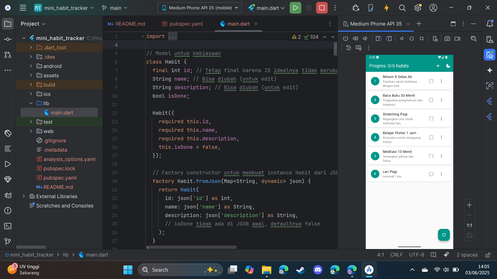
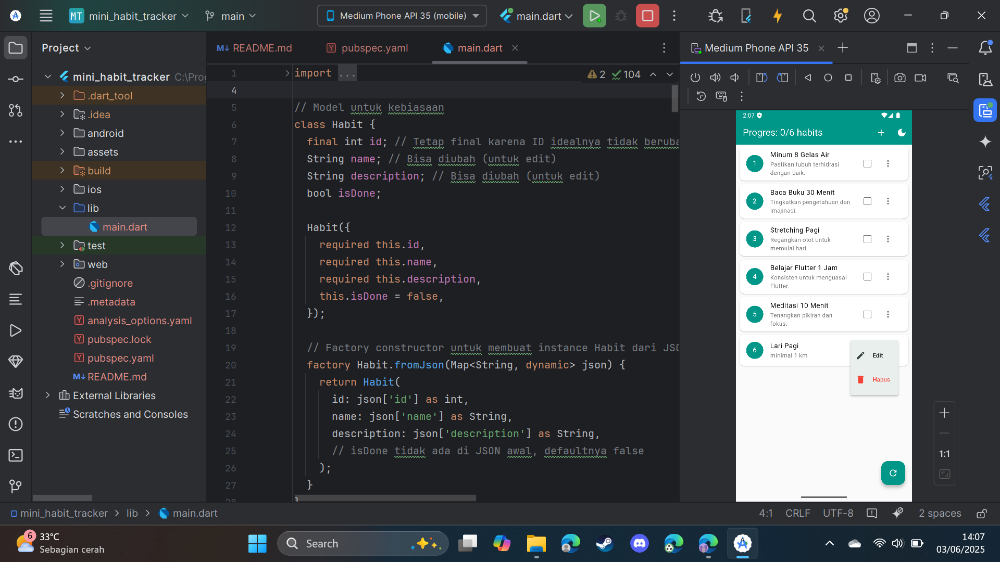
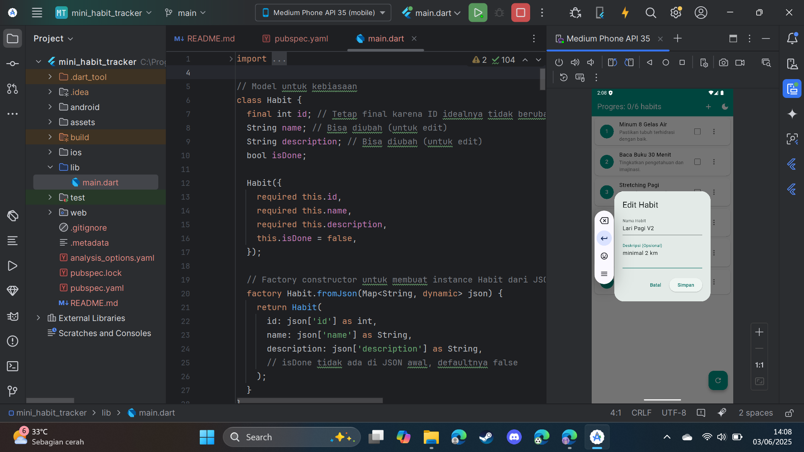
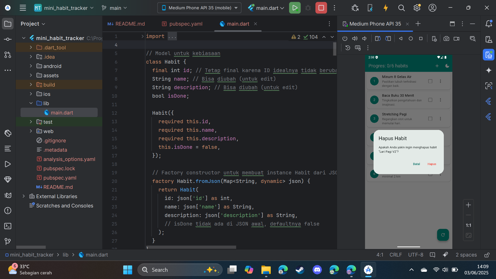
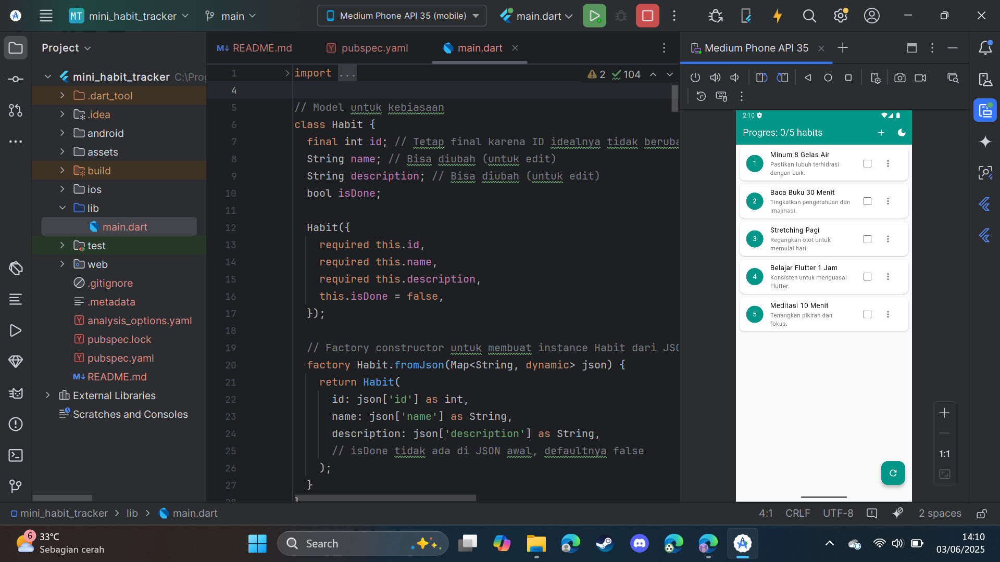
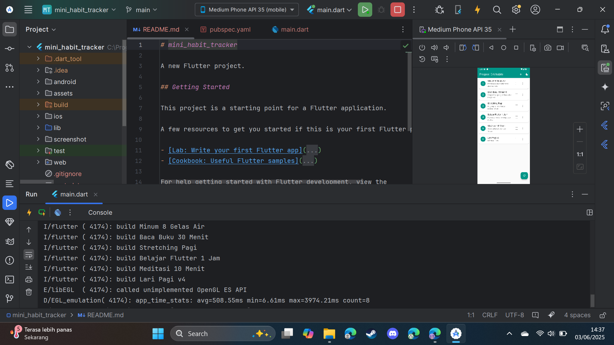

# Flutter Mini Habit Tracker

**Flutter Mini Habit Tracker** adalah aplikasi seluler yang dibangun menggunakan Flutter, dirancang untuk membantu pengguna membangun dan melacak kebiasaan positif harian. Aplikasi ini ditujukan bagi individu yang mencari alat sederhana dan langsung untuk memantau pertumbuhan pribadi mereka.

## Fitur dan Atribut

### Fitur Utama

* **Pembuatan Kebiasaan Baru**: Memungkinkan pengguna membuat kebiasaan dengan nama, ikon, dan frekuensi.
* **Pelacakan Progres Harian**: Tandai kebiasaan selesai atau belum untuk hari tertentu.
* **Visualisasi Data Progres**: Menampilkan grafik atau ringkasan sederhana progres harian.
* **Pengingat Notifikasi**: Mengatur pengingat agar tidak lupa menjalankan kebiasaan.
* **Manajemen Data Lokal**: Menyimpan data kebiasaan secara lokal di perangkat.
* **Tema Terang dan Gelap**: Dukungan tema terang dan gelap.
* **CRUD Kebiasaan**: Fungsionalitas Create, Read, Update, Delete pada kebiasaan.
* **Reset Progres**: Mereset status semua kebiasaan.

## Screenshots Uji Coba

* **1. Run Aplikasi**
  

* **2. Uji Strikethrough**
  

* **3. Uji Tambah Habit**
  * a. Klik tombol +
    
  * b. Gagal Simpan
    
  * c. Isi Form dan Simpan
    
    

* **4. Uji Edit Habit**
    * a. Klik menu tiga titik pada habit, pilih "Edit".
      
    * b. Dialog harus muncul dengan data habit tersebut.
      
    * c. Ubah nama/deskripsi dan simpan. Verifikasi perubahan di list.
      

* **5. Uji Hapus Habit**
    * a. Klik menu tiga titik pada habit, pilih "Hapus".
      
    * b. Dialog konfirmasi harus muncul. Coba batalkan.
      
    * c. Coba hapus lagi dan konfirmasi. Verifikasi habit hilang dari list.
      

* **6. Uji Progress Bar**
  

* **7. Uji Reset**
  

* **8. Uji Ephemeral State**
  

* **9. Amati Output print**
  
  * `print('build ${habit.name}')` adalah indikator bahwa Flutter sedang merender atau merender ulang representasi visual dari sebuah kebiasaan. Setiap aksi yang menyebabkan perubahan pada data yang ditampilkan oleh `ListView.builder` (seperti menambah, mengedit, menghapus, mengubah status) atau perubahan tampilan global (seperti tema) akan memicu pemanggilan `setState`. Pemanggilan `setState` ini memberitahu Flutter untuk menjadwalkan pembangunan ulang widget yang relevan. Karena `ListView.builder` bergantung pada daftar _habits dan state lainnya (seperti _isDarkMode), ia akan membangun ulang item-itemnya sesuai kebutuhan, yang pada gilirannya menjalankan itemBuilder dan mengeksekusi pernyataan print tersebut.


## Cara Menjalankan Aplikasi

1. Pastikan Flutter SDK terinstall
2. Clone repository ini
3. Jalankan command berikut:
```bash
flutter pub get
flutter run
```
