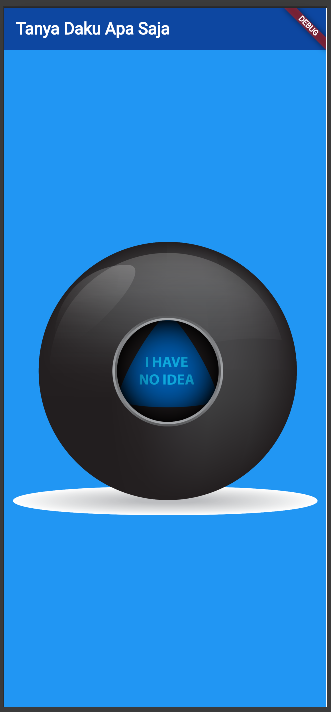

# Tanya Daku

## 📜 Deskripsi Singkat

**Tanya Daku** adalah aplikasi Flutter sederhana yang terinspirasi dari mainan klasik *Magic 8-Ball*. Aplikasi ini menyediakan cara yang menyenangkan untuk mendapatkan "jawaban" atas pertanyaan apa pun yang Anda ajukan. Cukup pikirkan sebuah pertanyaan, ketuk bola ajaib di layar, dan biarkan takdir memberikan jawabannya!

## ✨ Fitur-fitur Utama

* **Antarmuka Interaktif:** Cukup satu ketukan pada bola untuk memunculkan jawaban baru.
* **Jawaban Acak:** Aplikasi akan menampilkan salah satu dari lima gambar bola jawaban secara acak.
* **Desain Minimalis:** Tampilan yang bersih dengan fokus utama pada fungsionalitas bola ajaib.
* **Ringan dan Cepat:** Dibangun dengan Flutter untuk performa yang lancar.

## 📸 Screenshot




*<p align="center">Tampilan utama aplikasi saat dijalankan.</p>*

## 🚀 Cara Menjalankan Aplikasi

Berikut adalah panduan singkat untuk menjalankan proyek.

### Langkah-langkah Instalasi

1.  **Clone repository ini:**
    ```bash
    git clone [link-repo.git]
    ```
    *(Jangan lupa ganti URL repository di atas)*

2.  **Masuk ke direktori proyek:**
    ```bash
    cd nama-repo-anda
    ```

3. **Dapatkan semua package yang dibutuhkan:**
    Jalankan perintah ini di terminal dari direktori proyek Anda.
    ```bash
    flutter pub get
    ```

4. **Jalankan aplikasi:**
    ```bash
    flutter run
    ```