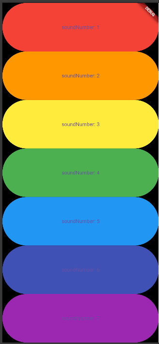

# Xylophone App

## 📜 Deskripsi Singkat

**Xylophone App** adalah aplikasi alat musik digital yang sederhana dan menyenangkan. Aplikasi ini mengubah ponsel Anda menjadi sebuah xylophone dengan tujuh tuts berwarna. Setiap tuts, saat ditekan, akan memainkan nada musik yang berbeda, memberikan pengalaman bermain musik yang mudah diakses oleh siapa saja dan dari segala usia.

## ✨ Fitur-fitur Utama

* **Tuts Berwarna Pelangi:** Tujuh tuts interaktif dengan warna-warni yang cerah dan menarik.
* **Audio Interaktif:** Setiap tuts dirancang untuk memainkan file audio `.wav` yang unik, menghasilkan nada musik yang jelas.
* **Tata Letak Responsif:** Tuts secara otomatis menyesuaikan ukurannya untuk mengisi lebar layar, memberikan pengalaman yang konsisten di berbagai perangkat.
* **Penggunaan Library Eksternal:** Memanfaatkan package `audioplayers` untuk memutar audio dengan mudah dan efisien.

## 📸 Screenshot


*<p align="center">Tampilan utama aplikasi Xylophone dengan 7 tuts berwarna.</p>*

## 🚀 Cara Menjalankan Aplikasi

Berikut adalah panduan untuk menginstal dan menjalankan proyek ini.

### Langkah-langkah Instalasi

1.  **Clone repository ini:**
    ```bash
    git clone [link-repo.git]
    ```
    *(Ganti URL repository di atas dengan URL Anda)*

2.  **Masuk ke direktori proyek:**
    ```bash
    cd nama-repo-anda
    ```

5.  **Dapatkan semua package (dependencies):**
    Jalankan perintah ini di terminal untuk mengunduh package `audioplayers` dan mendaftarkan assets Anda.
    ```bash
    flutter pub get
    ```

6.  **Jalankan aplikasi:**
    ```bash
    flutter run
    ```