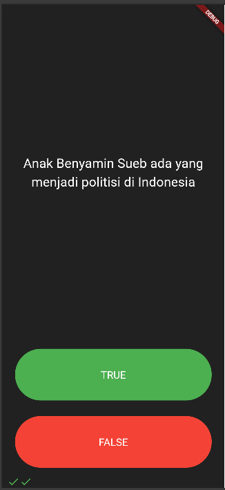
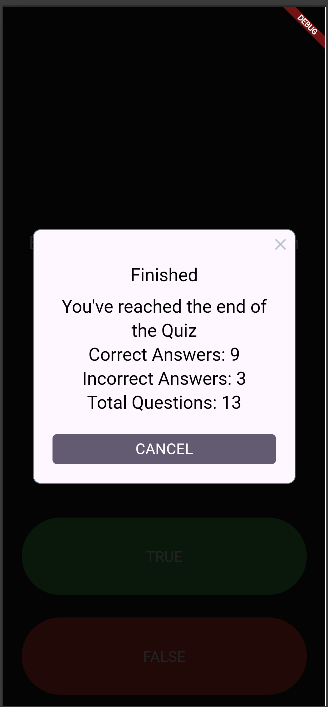

# Quizzler

## 📜 Deskripsi Singkat

**Quizzler** adalah aplikasi kuis interaktif yang dibuat dengan Flutter. Aplikasi ini dirancang untuk menguji pengetahuan pengguna melalui serangkaian pertanyaan Benar/Salah. Edisi khusus ini berfokus pada fakta-fakta menarik seputar seniman legendaris Betawi, Benyamin Sueb, dan budaya Betawi yang terkait.

Aplikasi ini memberikan umpan balik visual secara langsung untuk setiap jawaban dan menampilkan skor akhir ketika semua pertanyaan telah dijawab.

## ✨ Fitur-fitur Utama

* **Kuis Interaktif:** Pengguna menjawab pertanyaan dengan menekan tombol "TRUE" atau "FALSE".
* **Tema Spesifik:** Konten kuis yang unik dan mendidik tentang tokoh budaya Indonesia, Benyamin Sueb.
* **Pelacak Skor Visual:** Terdapat barisan ikon di bagian bawah layar yang langsung menampilkan apakah jawaban pengguna benar (✅) atau salah (❌).
* **Umpan Balik di Akhir Kuis:** Setelah kuis selesai, sebuah notifikasi akan muncul menampilkan rekap skor (jumlah benar, salah, dan total pertanyaan).
* **Pemisahan Logika dan Tampilan:** Proyek ini menerapkan prinsip desain yang baik dengan memisahkan logika kuis (`quiz_brain.dart`) dari antarmuka pengguna (`main.dart`).

## 📁 Struktur Proyek

Proyek ini terdiri dari beberapa file utama di dalam direktori `lib/`:

* `main.dart`: File utama yang menangani semua elemen antarmuka pengguna (UI), state management untuk halaman kuis, dan interaksi tombol.
* `quiz_brain.dart`: "Otak" dari aplikasi. File ini berisi daftar pertanyaan, mengelola logika untuk berpindah ke pertanyaan berikutnya, memeriksa jawaban, dan mereset kuis.
* `question.dart`: Sebuah model class sederhana yang mendefinisikan struktur objek untuk setiap pertanyaan, yang terdiri dari teks pertanyaan (`String`) dan jawabannya (`bool`).

## 📸 Screenshot


*<p align="center">Tampilan utama aplikasi saat kuis berlangsung.</p>*


*<p align="center">Tampilan utama aplikasi saat kuis selesai.</p>*

## 🚀 Cara Menjalankan Aplikasi

Berikut adalah panduan untuk menginstal dan menjalankan proyek ini.

### Langkah-langkah Instalasi

1.  **Clone atau Unduh Proyek:**
    Jika ini adalah sebuah repository Git, clone proyeknya.
    ```bash
    git clone [link-repo.git]
    cd nama-repo-anda
    ```

2. **Dapatkan Dependencies:**
    Jalankan perintah ini di terminal dari direktori utama proyek Anda untuk mengunduh package yang dibutuhkan.
    ```bash
    flutter pub get
    ```

3. **Jalankan Aplikasi:**
    Pastikan emulator atau perangkat Anda sudah siap, lalu jalankan perintah berikut:
    ```bash
    flutter run
    ```