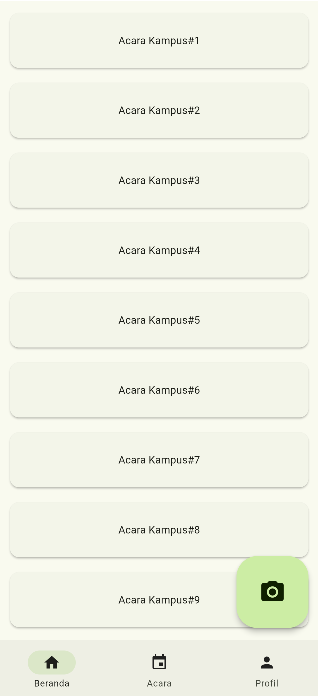

# Adaptive Responsive

Adaptive and Responsive Application

## Deskripsi
Aplikasi Flutter yang memanfaatkan paket `flutter_adaptive_scaffold` untuk membuat layout antarmuka yang adaptif berdasarkan ukuran layar.

Pada layar kecil (<600dp), navigasi akan otomatis menjadi `BottomNavigationBar` dengan tombol aksi (FAB) di pojok kanan bawah.

## Fitur

- **Adaptive Navigation**: BottomNavigationBar, NavigationRail, atau Drawer, sesuai lebar layar.
- **Responsive Grid**: GridView yang menyesuaikan jumlah kolom (1–3) berdasarkan ukuran layar.
- **Floating Action Button**: Tombol kamera besar di layar kecil.
- **Material 3**: Dukungan tema Material 3 dengan `colorSchemeSeed`.

## Struktur Kode Utama

- `AdaptiveDemo` (root widget)
- `HomePage` (stateful widget dengan adaptive scaffold)
- `_FeedGrid` (menampilkan daftar acara dalam grid)

## Screenshot

---
