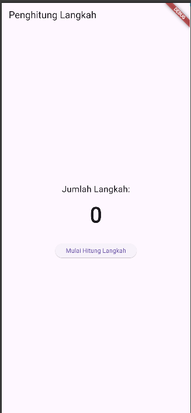
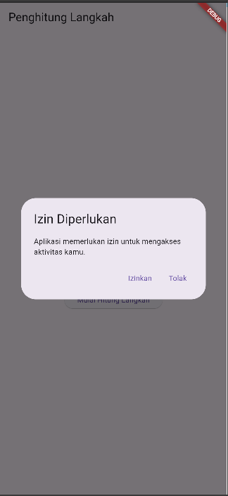
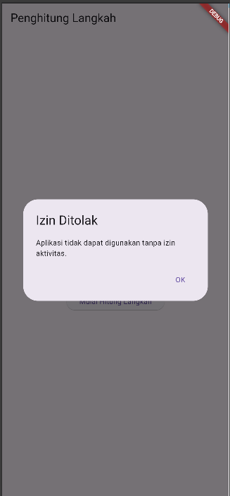

# Aplikasi Penghitung Langkah (Pedometer)

## 📜 Deskripsi Singkat

**Penghitung Langkah** adalah sebuah aplikasi Flutter sederhana yang berfungsi untuk menghitung jumlah langkah pengguna secara *real-time*. Aplikasi ini memanfaatkan sensor gerak bawaan perangkat dan mengimplementasikan alur permintaan izin (permission) yang benar untuk mengakses data aktivitas fisik, sehingga memastikan fungsionalitas dan privasi pengguna terjaga dengan baik.

## ✨ Fitur-fitur Utama

* **Penghitungan Langkah Real-time:** Menggunakan package `pedometer` untuk mendengarkan dan menampilkan data langkah langsung dari sensor perangkat.
* **Manajemen Izin Profesional:** Menggunakan package `permission_handler` untuk meminta izin `Activity Recognition` kepada pengguna sebelum mengakses sensor.
* **Alur Pengguna yang Jelas:** Memberikan dialog informatif kepada pengguna untuk menjelaskan mengapa izin diperlukan dan menangani kasus jika izin ditolak.
* **Antarmuka Minimalis:** Tampilan yang bersih dan mudah dibaca, berfokus pada penyajian data jumlah langkah secara jelas.

## 📸 Screenshot

Letakkan screenshot aplikasi Anda di sini. Ganti `screenshot.png` dengan nama file gambar Anda dan pastikan gambar tersebut ada di dalam direktori proyek (misalnya di dalam folder `assets`).


*<p align="center">Tampilan utama aplikasi saat langkah sedang dihitung.</p>*


*<p align="center">Tampilan aplikasi saat meminta izin akses.</p>*


*<p align="center">Tampilan aplikasi saat izin ditolak.</p>*

## 🚀 Cara Menjalankan Aplikasi

### Langkah-langkah Instalasi

1.  **Clone atau Siapkan Proyek:**
    Buat proyek Flutter baru dan letakkan kode Anda di dalam file `lib/main.dart`.

2. **Dapatkan Dependencies:**
    Jalankan perintah ini di terminal dari direktori utama proyek Anda untuk mengunduh semua package yang dibutuhkan.
    ```bash
    flutter pub get
    ```

3. **Jalankan Aplikasi:**
    Hubungkan perangkat fisik Anda, lalu jalankan perintah berikut:
    ```bash
    flutter run
    ```
    Setelah aplikasi berjalan, tekan tombol "Mulai Hitung Langkah" dan berikan izin yang diminta.
