# Ujian Tengah Semester PBM

## 👥 Nama dan Npm
| Nama                  | NPM        |
|-----------------------|------------|
| Arsya Yan Duribta | 4522210117 |

## 🔗 Link Video Demo
📺 [Tonton Demo di YouTube](https://youtu.be/VIDEO_ID)

Aplikasi Flutter untuk manajemen aktivitas harian, jadwal kuliah,dan profil mahasiswa dengan dukungan toggle dark mode.

## Fitur Utama
- ✅ Checklist aktivitas harian & Menampilkan Quotes
- 📅 Menampilkan jadwal kuliah dalam bentuk Card
- 🌓 Dark/Light mode toggle
- 📱 Responsive layout dengan Adaptive Scaffold

## Library yang Digunakan
- `flutter_adaptive_scaffold`: Untuk layout responsif
- `material`: Komponen desain Material

## Penjelasan Halaman

### 1. Beranda (Kegiatan Mahasiwa)
- Menampilkan quote inspiratif
- Checklist aktivitas harian dengan:
    - Nama aktivitas
    - Tanggal
    - Toggle checkbox status selesai
- 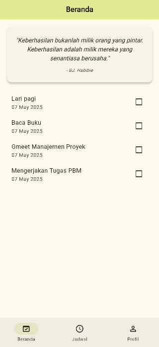
- 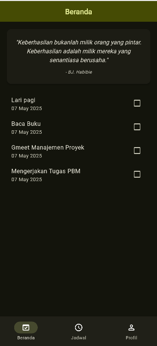
- 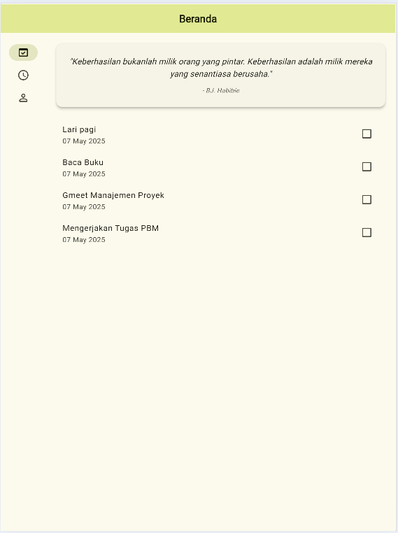
- 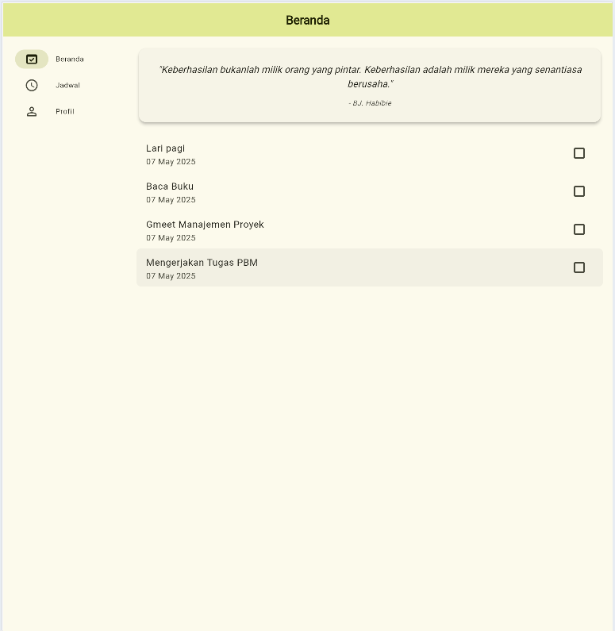

### 2. Jadwal Kuliah
- Menampilkan jadwal kuliah per hari dalam bentuk Card
- Informasi yang ditampilkan:
    - Mata kuliah
    - Kelas
    - SKS
    - Jam
    - Nama dosen
- Responsive table dengan horizontal scroll
- 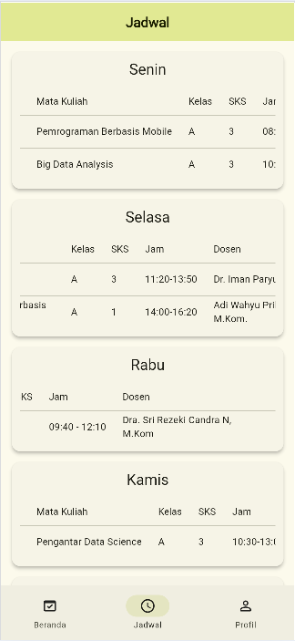
- 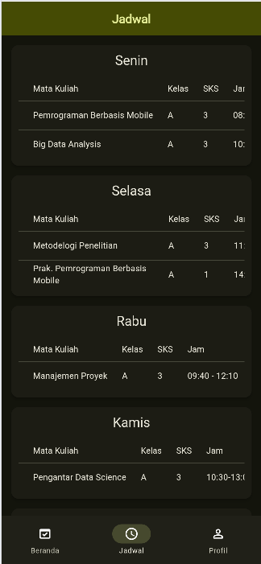
- 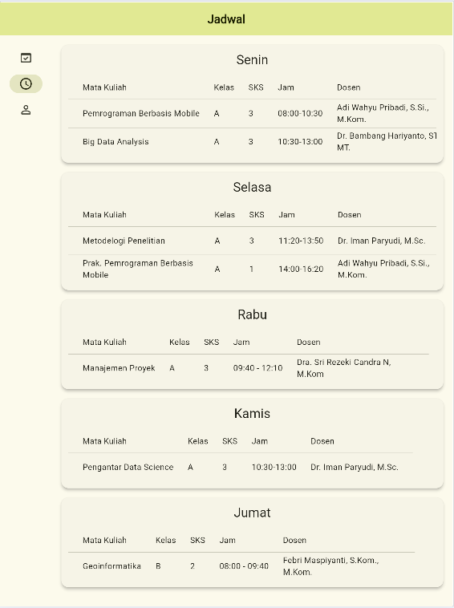
- 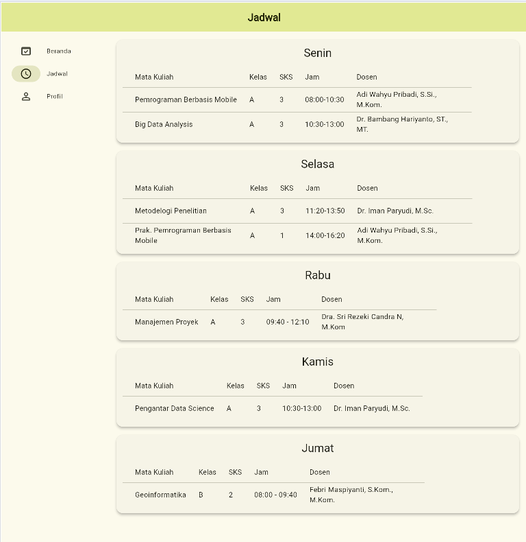
- 
### 3. Profil (AkunPage)
- Menampilkan profil mahasiswa dengan:
    - Foto profil
    - Nama
    - NIM
    - Email
- Toggle dark/light mode
- Desain card dengan border circle avatar
- 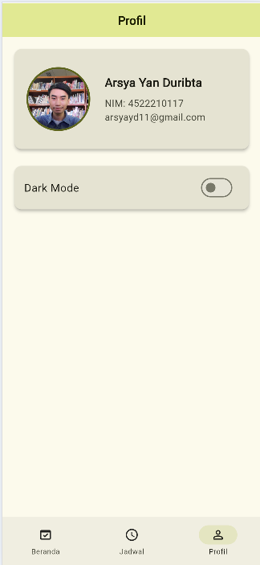
- 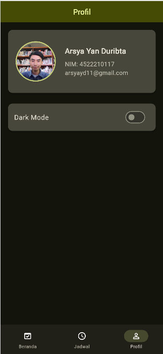
- 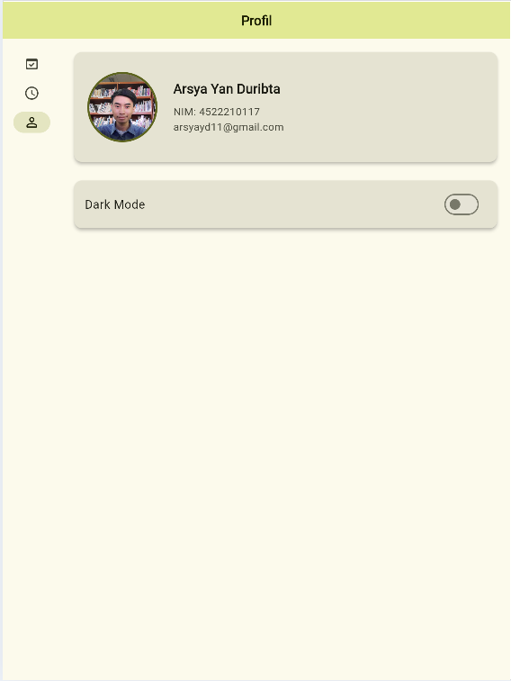
- 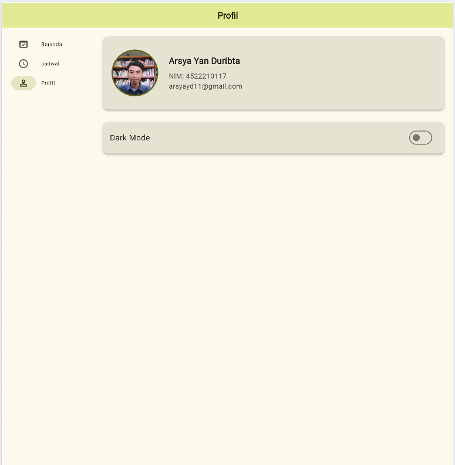
- 
## Cara Menjalankan Aplikasi

1. Pastikan Flutter SDK terinstall
2. Clone repository ini
3. Jalankan command berikut:

```bash
flutter pub get
flutter run